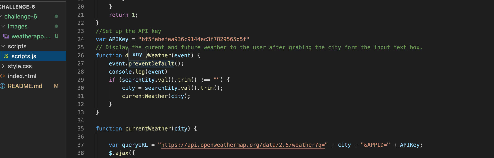
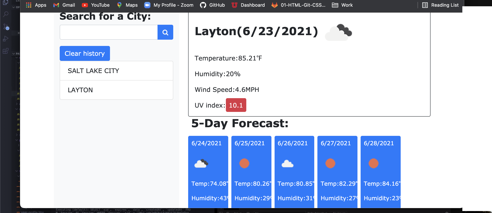

# challenge-6
Weather Application- Challenge-6 
### Table of Contents
- [Description](#description)
- [Introduction](#introduction)
- [Challenges](#challenges)
- [Victories](#victories)
- [Resources](#resources)

---

## Description
A functioning Weather Application using a weather API that gives us the ability to pull the weather from different cities. 

---

## Introduction 
This week we were challenged to create a Weather Application using a weather API from openweathermap.org.

---

## Challenges

This particular challenge came with a couple challenges. One in particular was figuring out how to properly utilize the API and generate a workig API key.

---

## Victories
I was able to get the Weather Dashboard to function properly! 

---

## Resources 

<a href="">GitHub Repo</a>

<a href="https://www.youtube.com/watch?v=eVGEea7adDM"> YouTube</a>

<a href="https://www.google.com/webhp?hl=en&sa=X&ved=0ahUKEwiLjJ7fosLvAhWXW80KHawRD_oQPAgI">Google</a>

<a href="https://www.w3schools.com/charsets/ref_html_ascii.asp">w3 Schools</a>

<a href="https://openweathermap.org/">OpenWeather</a>

